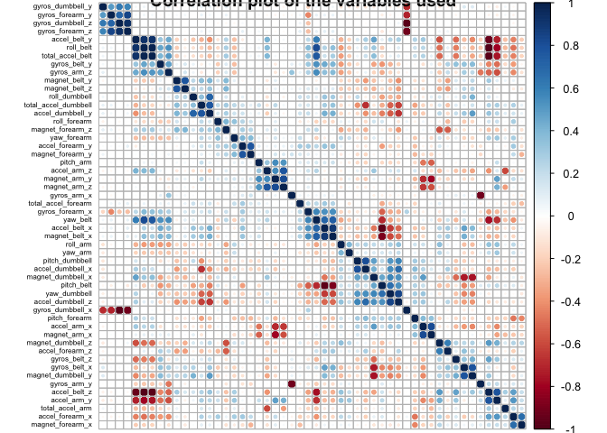

Objective
=========

The goal of your project is to predict the manner in which they did the
exercise. This is the "classe" variable in the training set. You may use
any of the other variables to predict with. You should create a report
describing how you built your model, how you used cross validation, what
you think the expected out of sample error is, and why you made the
choices you did. You will also use your prediction model to predict 20
different test cases.

Analysis
========

Analysis steps
--------------

. Load the data and required packages . Clean data . Correlation Matrix
. Partitioning the data . Train models . Model comparison . Submission .
Appendix

Load the data and required packages
-----------------------------------

In this step we get all the packages needed for this task. Furthermore
we load the data in case it's not yeat stored in the working directory.

    library(caret)

    ## Warning: package 'caret' was built under R version 3.4.3

    ## Loading required package: lattice

    ## Loading required package: ggplot2

    ## Warning in as.POSIXlt.POSIXct(Sys.time()): unknown timezone 'default/
    ## Australia/Hobart'

    library(randomForest)

    ## randomForest 4.6-12

    ## Type rfNews() to see new features/changes/bug fixes.

    ## 
    ## Attaching package: 'randomForest'

    ## The following object is masked from 'package:ggplot2':
    ## 
    ##     margin

    library(rpart)
    library(rpart.plot)
    library(tidyverse)

    ## Loading tidyverse: tibble
    ## Loading tidyverse: tidyr
    ## Loading tidyverse: readr
    ## Loading tidyverse: purrr
    ## Loading tidyverse: dplyr

    ## Warning: package 'tibble' was built under R version 3.4.1

    ## Warning: package 'tidyr' was built under R version 3.4.1

    ## Warning: package 'purrr' was built under R version 3.4.1

    ## Warning: package 'dplyr' was built under R version 3.4.1

    ## Conflicts with tidy packages ----------------------------------------------

    ## combine(): dplyr, randomForest
    ## filter():  dplyr, stats
    ## lag():     dplyr, stats
    ## lift():    purrr, caret
    ## margin():  ggplot2, randomForest

    library(ggplot2)
    library(corrplot)

    ## Warning: package 'corrplot' was built under R version 3.4.2

    ## corrplot 0.84 loaded

    setwd("/Users/mebner/Documents/for_me/R_coursera/GitHub/practical-machine-learning")

    if (!file.exists("train.csv")){
      fileURL <- "https://d396qusza40orc.cloudfront.net/predmachlearn/pml-training.csv"
      download.file(fileURL, "train.csv", method="curl")
    }  
    if (!file.exists("test.csv")) { 
      fileURL <- "https://d396qusza40orc.cloudfront.net/predmachlearn/pml-testing.csv"
      download.file(fileURL, "test.csv", method="curl")
    }

Clean data
----------

First we unify corrupted values like NAs, empty cells or DIV/0!.

Second we are removing unnecassary columns that . are mostly empty (&lt;
60%) . contain non numerica data which can't be used for predicting

    # Replace all missing fields with NA 
    train <- read.csv("train.csv",na.strings=c("NA","DIV/0!",""))
    test <- read.csv("test.csv",na.strings=c("NA","DIV/0!",""))

    # Remove first 7 columns which can't be used for predicting
    train   <-train[,-c(1:7)]
    test <-test[,-c(1:7)]

    #Remove columns with more than 60% NAs
    nzv_col <- nearZeroVar(train)
    train <- train[, -nzv_col]

    corrupted_col <- sapply(train, function(x) {sum(!(is.na(x) | x == ""))})
    null_col <- names(corrupted_col[corrupted_col < 0.6 * length(train$classe)])
    train <- train[, !names(train) %in% null_col]

Correlations
============

First we want to look at the correlations in order to gain some
information that might be helpful when it comes to pick one ore multiple
algorythms for our model.

    corrplot(cor(train[-53]),tl.col="black",title= "Correlation plot of the variables used", order = "hclust",tl.cex = 0.5,tl.pos="l")

We see some strong correlations which helps us when picking the models.

Running the Models
==================

Picking the algorythms
----------------------

So are using multiple numeric predictors to predict a non numeric
variable that leaves us with a bunch of potential algorythms to work
with to name some of them:

. Kernel SVM . Random Forest . Neural Network . Gradient Boosting Tree .
Decision Tree . Logistic Regression . Naive Bayes . Linear SVM

We'll pick two out of them one that is fast and anotherone that might
give us a higher level of Accuracy

. Speed -&gt; Decision Tree . Accuracy -&gt; Random Forest

Partition the data
------------------

    subs <- createDataPartition(y=train$classe, p=0.75, list=FALSE)
    subtrain <- train[subs, ] 
    subtest <- train[-subs, ]

1st Approach: Decision Tree
---------------------------

It is a type of supervised learning algorithm that is mostly used for
classification problems. It works for both categorical and continuous
dependent variables. The it makes it easy to explain the steps of the
prediction, however it's not known to be very accurate.

    #Decision Tree
    mod1 <- rpart(classe ~ ., data=subtrain, method="class")
    pred1 <- predict(mod1, subtest, type = "class")
    confusionMatrix(pred1, subtest$classe)

    ## Confusion Matrix and Statistics
    ## 
    ##           Reference
    ## Prediction    A    B    C    D    E
    ##          A 1256  132    9   48   10
    ##          B   47  614   78   66   84
    ##          C   33   91  700  134   96
    ##          D   21   67   49  509   59
    ##          E   38   45   19   47  652
    ## 
    ## Overall Statistics
    ##                                           
    ##                Accuracy : 0.7608          
    ##                  95% CI : (0.7486, 0.7727)
    ##     No Information Rate : 0.2845          
    ##     P-Value [Acc > NIR] : < 2.2e-16       
    ##                                           
    ##                   Kappa : 0.697           
    ##  Mcnemar's Test P-Value : < 2.2e-16       
    ## 
    ## Statistics by Class:
    ## 
    ##                      Class: A Class: B Class: C Class: D Class: E
    ## Sensitivity            0.9004   0.6470   0.8187   0.6331   0.7236
    ## Specificity            0.9433   0.9305   0.9126   0.9522   0.9628
    ## Pos Pred Value         0.8632   0.6907   0.6641   0.7220   0.8140
    ## Neg Pred Value         0.9597   0.9166   0.9597   0.9297   0.9393
    ## Prevalence             0.2845   0.1935   0.1743   0.1639   0.1837
    ## Detection Rate         0.2561   0.1252   0.1427   0.1038   0.1330
    ## Detection Prevalence   0.2967   0.1813   0.2149   0.1438   0.1633
    ## Balanced Accuracy      0.9218   0.7887   0.8656   0.7926   0.8432

2nd Approach: Random Forrest
----------------------------

RF can handle correlated variables pretty well, that's why comes in
handy here. It develops losts of decsion trees based on random selection
of data and random selection of variables.

This sounds as it requires some calculation effort and that's exactly
the trade off: Accuracy VS Speed.

    #Random Forest
    mod2 <- randomForest(classe ~. , data=subtrain, method="class")
    pred2 <- predict(mod2, subtest)
    confusionMatrix(pred2, subtest$classe)

    ## Confusion Matrix and Statistics
    ## 
    ##           Reference
    ## Prediction    A    B    C    D    E
    ##          A 1394    9    0    0    0
    ##          B    1  939    5    0    0
    ##          C    0    1  850   11    0
    ##          D    0    0    0  793    2
    ##          E    0    0    0    0  899
    ## 
    ## Overall Statistics
    ##                                          
    ##                Accuracy : 0.9941         
    ##                  95% CI : (0.9915, 0.996)
    ##     No Information Rate : 0.2845         
    ##     P-Value [Acc > NIR] : < 2.2e-16      
    ##                                          
    ##                   Kappa : 0.9925         
    ##  Mcnemar's Test P-Value : NA             
    ## 
    ## Statistics by Class:
    ## 
    ##                      Class: A Class: B Class: C Class: D Class: E
    ## Sensitivity            0.9993   0.9895   0.9942   0.9863   0.9978
    ## Specificity            0.9974   0.9985   0.9970   0.9995   1.0000
    ## Pos Pred Value         0.9936   0.9937   0.9861   0.9975   1.0000
    ## Neg Pred Value         0.9997   0.9975   0.9988   0.9973   0.9995
    ## Prevalence             0.2845   0.1935   0.1743   0.1639   0.1837
    ## Detection Rate         0.2843   0.1915   0.1733   0.1617   0.1833
    ## Detection Prevalence   0.2861   0.1927   0.1758   0.1621   0.1833
    ## Balanced Accuracy      0.9984   0.9940   0.9956   0.9929   0.9989

Comparison
==========

It's save to say that the random forrest method is performing better.
It's much more accurate: 99.59% compared to 71.88%. The out of sample
error is &lt; 0.005 (1 - accuracy for predictions made against the cross
validation subset = 1 - 0.9959 = &lt; 0.005).

Submission
----------

Finally we can use the selected model (RF) to predict the outcomes of
the original test data set.

    # predict the outcome of the original testing data set
    predict_final <- predict(mod2, test, type="class")
    predict_final

    ##  1  2  3  4  5  6  7  8  9 10 11 12 13 14 15 16 17 18 19 20 
    ##  B  A  B  A  A  E  D  B  A  A  B  C  B  A  E  E  A  B  B  B 
    ## Levels: A B C D E

Appendix
========

Decision Tree visualisation
---------------------------

    rpart.plot(mod1, main="Classification Tree", extra=102, under=TRUE, faclen=0)

